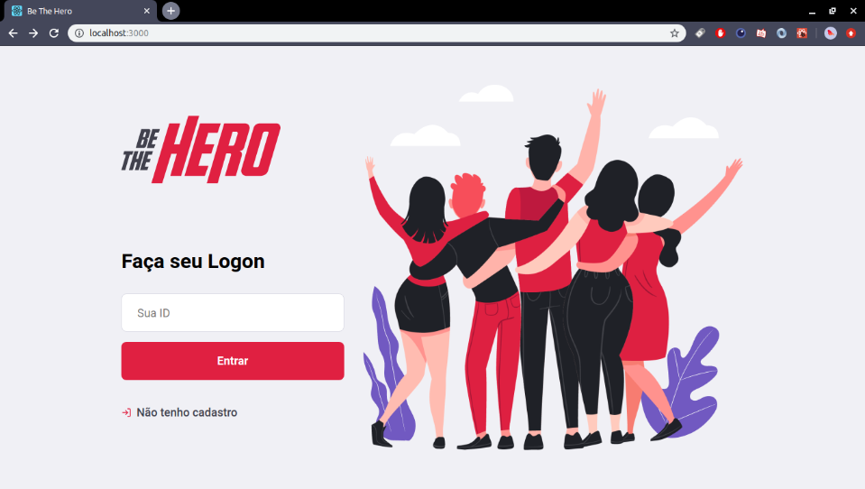
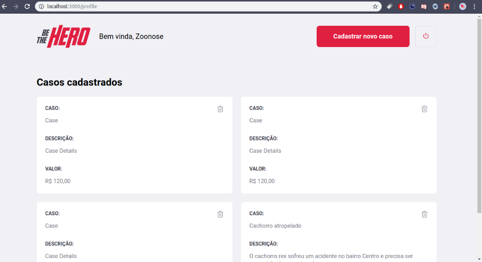
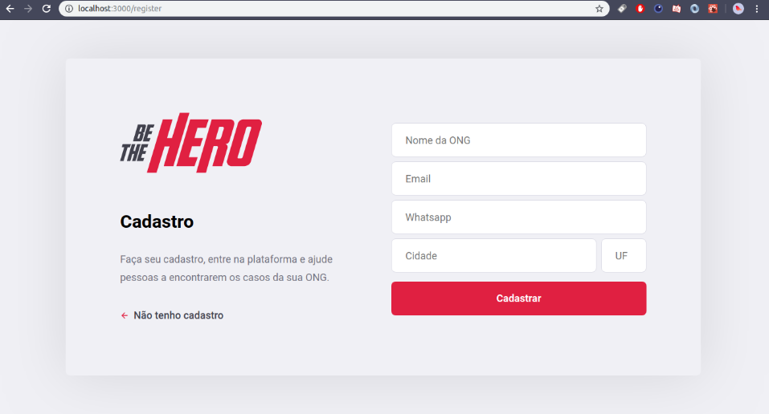
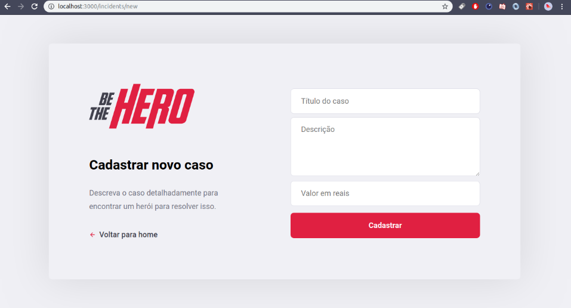
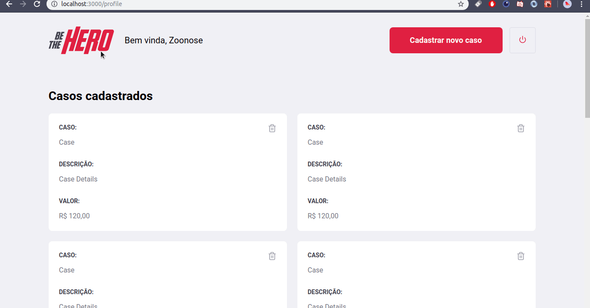

<h1 align="center">

   

 
Be The Hero
</h1>

 Uma aplicação web e mobile que serve para que ONGs possam encontrar heróis disponíveis para resolver os seus casos desenvolvido durante a semana OmniStack 11.0

  

  

  

<h2 align="center">
   Versão Web
</h2>

## Páginas

#### Página de Login

#### Página de Perfil

#### Página de Cadastros ONG 

#### Página de Cadastros Casos da ONG

### Exemplo 

