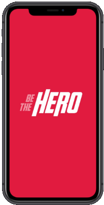
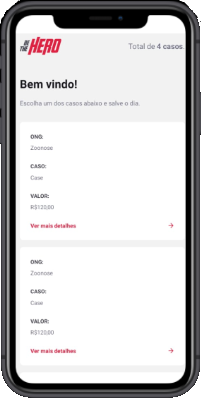
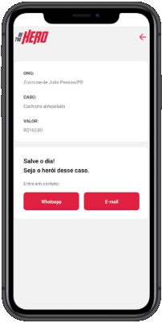

<h1 align="center">

   

 
Be The Hero App
</h1>

 Uma aplicação web e mobile que serve para que ONGs possam encontrar heróis disponíveis para resolver os seus casos desenvolvido durante a semana OmniStack 11.0

<h2 align="center">
   Versão Mobile
</h2>

## Telas da Aplicação

